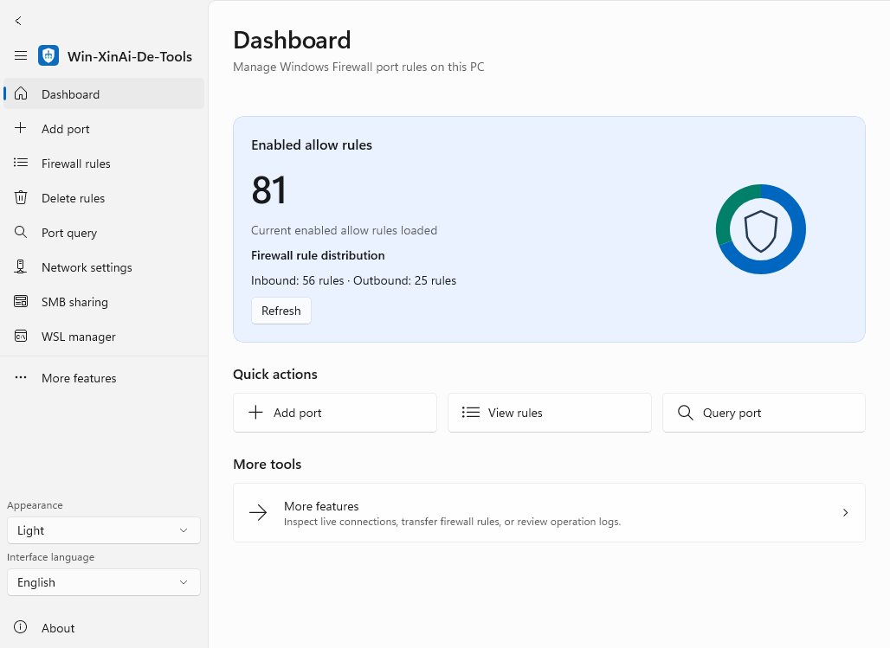
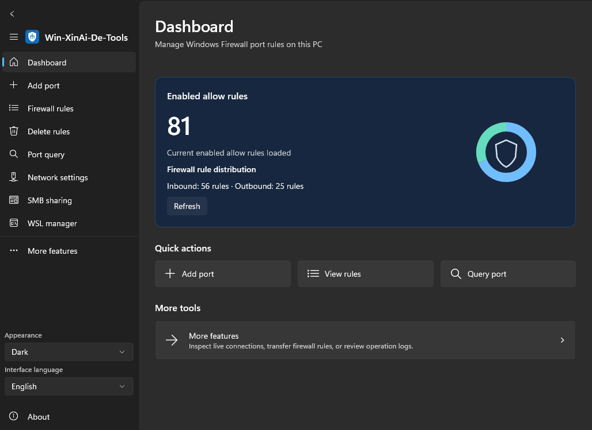
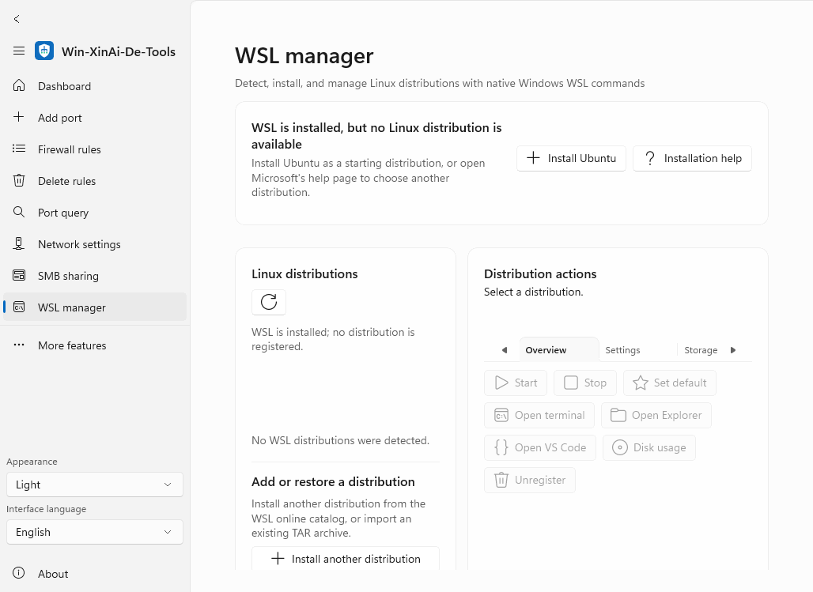

# Win-XinAi-De-Tools

**English** | [简体中文](README.zh-CN.md)

Win-XinAi-De-Tools is a native Windows utility for network configuration, Windows Defender Firewall rules, SMB sharing, and Windows Subsystem for Linux (WSL) management. It is built with WinUI 3, Windows App SDK, and Windows Community Toolkit, with SkiaSharp chart rendering, and its interface can switch between English and Simplified Chinese at runtime.

## Current release

**v1.8.0** — [Download from GitHub Releases](https://github.com/logdns/Win-XinAi-De-Tools/releases/tag/v1.8.0)

See [CHANGELOG.md](CHANGELOG.md) for the release history.

## Features

- Temporary HTTP server on port 8980 (customizable), with a selectable/openable folder, Start/Stop/Restart, all-interface access, and automatic temporary Windows Firewall rules. See [usage and internet access](docs/TEMPORARY-HTTP.md).

- Modern native UI with saved System/Light/Dark appearance, theme-aware dialogs, and Windows animation preferences.
- A Skia-rendered dashboard chart, responsive layouts across all 14 pages, wrapping toolbars, and history-based Back/Alt+Left navigation.

- Add, search, list, and delete TCP, UDP, or ANY Windows Firewall rules for inbound, outbound, or bidirectional traffic.
- Configure adapter IPv4, DHCP, DNS, gateway, route metric, and the default route with validation and confirmation.
- Toggle SMB Direct and SMB 1.0/CIFS, optionally restart Windows immediately, and manage the fixed `share` folder share.
- Monitor active TCP and UDP connections, map them to processes, close TCP connections, or terminate a process with confirmation.
- Back up and restore firewall rules as JSON and review an append-only audit log.
- Detect WSL installation and runtime state, browse and install distributions, import TAR archives, start or stop distributions, set the default distribution, refresh state, and open a terminal.
- Terminate or unregister distributions, inspect disk usage, open Explorer or VS Code, import or export TAR archives, mount VHDX files, migrate distributions, schedule commands, configure an HTTP proxy or IPv4 port forwarding, and manage usbipd-win devices.
- Use `/silent`, start automatically at logon, start minimized to the notification area, and optionally shut down WSL when the application exits.

## Interface previews

The following images are captured from the packaged Windows application by the UI verification workflow:







Appearance and language are available at the bottom of the sidebar and are restored on restart. Back returns to the actual previous page. Theme changes preserve drafts; changing language reloads pages and resets unsubmitted forms. See [UI behavior, validation, and release procedure](docs/UI-AND-VALIDATION.md).

## WSL integration

The WSL page is a native WinUI management interface implemented in this repository. If WSL is unavailable, it provides an elevated `wsl.exe --install` action, waits for the installer, reports the exit result, and links to Microsoft's installation guide. The distribution panel always provides access to WSL's online catalog and TAR import.

Runtime state is read from WSL's running-distribution list instead of localized status text, and Linux command output is decoded as UTF-8. Distribution actions and advanced settings are separated into responsive, scrollable tabs.

The workflow follows common WSL dashboard patterns, but this project is an independent implementation and does not copy or bundle third-party dashboard source code or assets.

## Installation

Windows 10 version 1809 (build 17763) or later is required. The one-command `wsl --install` workflow requires Windows 10 version 2004 (build 19041) or later; earlier supported builds must follow Microsoft's manual WSL installation guide. Administrator privileges are required for firewall, network, SMB, and WSL installation changes.

Choose the package matching your Windows architecture:

| Architecture | Portable ZIP | Installer |
|---|---|---|
| x86 | [Win-XinAi-De-Tools-win-x86.zip](https://github.com/logdns/Win-XinAi-De-Tools/releases/download/v1.8.0/Win-XinAi-De-Tools-win-x86.zip) | [Win-XinAi-De-Tools-Setup-x86.exe](https://github.com/logdns/Win-XinAi-De-Tools/releases/download/v1.8.0/Win-XinAi-De-Tools-Setup-x86.exe) |
| x64 | [Win-XinAi-De-Tools-win-x64.zip](https://github.com/logdns/Win-XinAi-De-Tools/releases/download/v1.8.0/Win-XinAi-De-Tools-win-x64.zip) | [Win-XinAi-De-Tools-Setup-x64.exe](https://github.com/logdns/Win-XinAi-De-Tools/releases/download/v1.8.0/Win-XinAi-De-Tools-Setup-x64.exe) |
| ARM64 | [Win-XinAi-De-Tools-win-arm64.zip](https://github.com/logdns/Win-XinAi-De-Tools/releases/download/v1.8.0/Win-XinAi-De-Tools-win-arm64.zip) | [Win-XinAi-De-Tools-Setup-arm64.exe](https://github.com/logdns/Win-XinAi-De-Tools/releases/download/v1.8.0/Win-XinAi-De-Tools-Setup-arm64.exe) |

The portable build is self-contained and does not require a separate .NET or Windows App SDK installation. Extract the ZIP and run `Win-XinAi-De-Tools.exe` as administrator. The installer creates a Start menu shortcut and can optionally create a desktop shortcut.

## Build and test

Build on Windows with Visual Studio 2022, the .NET desktop and Windows App SDK workloads, .NET 8 SDK, and Windows SDK 10.0.19041.0 or newer.

```powershell
dotnet publish Win-XinAi-De-Tools.csproj `
  --configuration Release `
  --runtime win-x64 `
  --self-contained true `
  -p:Platform=x64 `
  -p:WindowsPackageType=None `
  --output artifacts\portable\win-x64

dotnet test Win-XinAi-De-Tools.Tests\Win-XinAi-De-Tools.Tests.csproj --configuration Release
```

Replace `win-x64`/`x64` with `win-x86`/`x86` or `win-arm64`/`ARM64` for another target. Windows Firewall integration tests must run in an elevated Windows session.

## GitHub Actions

[`.github/workflows/build.yml`](.github/workflows/build.yml) runs .NET and native-helper tests, Windows Firewall integration tests, x86/x64/ARM64 builds, x64 GUI and notification-area smoke tests, all-page theme/layout/navigation checks with screenshots, direct/transitive dependency audits, portable ZIP packaging, Inno Setup installer creation, and release publication for version-matched `v*` tags. Third-party actions are pinned to immutable commits, and only the release job has repository write permission.

## Repository layout

- `Views/`: native WinUI pages.
- `Services/`: firewall, network, SMB, WSL, connection, transfer, audit, and notification-area services.
- `Models/`: domain models.
- `Win-XinAi-De-Tools.Tests/`: automated tests.
- `installer/`: Inno Setup definition.
- `Assets/`: application icons and resources.
- `native/`: optional Rust and Go WSL bridges.

The application calls `wsl.exe` directly by default. Set `WINXINAI_WSL_HELPER` to use a compiled optional bridge. See [native/README.md](native/README.md) for build commands.

## Security

Run the application as administrator only when required. SMB 1.0/CIFS is a legacy protocol with known security risks. Import only trusted JSON files. Network, process, and connection information is read locally and is not transmitted to a remote service.

## Contributing and license

Issues and pull requests should include the Windows version, architecture, application version, reproduction steps, and relevant entries from `%LOCALAPPDATA%\Win-XinAi-De-Tools\startup.log` or `audit.log`. Remove private data before publishing logs. See [CONTRIBUTING.md](CONTRIBUTING.md) for development guidance.

Win-XinAi-De-Tools is released under the [MIT License](LICENSE). See [THIRD-PARTY-NOTICES.md](THIRD-PARTY-NOTICES.md) for third-party notices.
