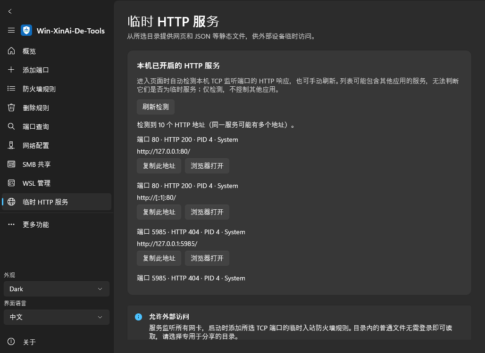

# Win-XinAi-De-Tools

**English** | [简体中文](README.zh-CN.md)

A native Windows utility for firewall rules, network settings, SMB, WSL, and temporary HTTP serving. Built with WinUI 3 and Skia dashboard graphics, with English/Chinese, light/dark themes, responsive layouts, and Back navigation.

## Download

**v1.9.0** · [GitHub Releases](https://github.com/logdns/Win-XinAi-De-Tools/releases/latest) · [Actions](https://github.com/logdns/Win-XinAi-De-Tools/actions/workflows/build.yml)

Requires Windows 10 1809 or later. Extract the portable ZIP or run the installer, then launch the app as administrator. Packages include the .NET and Windows App SDK runtimes.

| Architecture | Portable | Installer |
|---|---|---|
| x64 | [ZIP](https://github.com/logdns/Win-XinAi-De-Tools/releases/download/v1.9.0/Win-XinAi-De-Tools-win-x64.zip) | [EXE](https://github.com/logdns/Win-XinAi-De-Tools/releases/download/v1.9.0/Win-XinAi-De-Tools-Setup-x64.exe) |
| x86 | [ZIP](https://github.com/logdns/Win-XinAi-De-Tools/releases/download/v1.9.0/Win-XinAi-De-Tools-win-x86.zip) | [EXE](https://github.com/logdns/Win-XinAi-De-Tools/releases/download/v1.9.0/Win-XinAi-De-Tools-Setup-x86.exe) |
| ARM64 | [ZIP](https://github.com/logdns/Win-XinAi-De-Tools/releases/download/v1.9.0/Win-XinAi-De-Tools-win-arm64.zip) | [EXE](https://github.com/logdns/Win-XinAi-De-Tools/releases/download/v1.9.0/Win-XinAi-De-Tools-Setup-arm64.exe) |

[SHA256SUMS.txt](https://github.com/logdns/Win-XinAi-De-Tools/releases/download/v1.9.0/SHA256SUMS.txt) provides download checksums.

## Features

- **Temporary HTTP**: configurable port (8980 by default), folder selection/opening, Start/Stop/Restart, individual URL copy/open actions, and local HTTP detection with port/process details. Supports external access; see the [HTTP guide](docs/TEMPORARY-HTTP.md).
- **Firewall and networking**: manage rules, query ports, configure adapters/DNS/routes, inspect connections and processes, import/export rules, and review operation logs.
- **SMB**: manage SMB Direct, SMB 1.0/CIFS, and folder sharing.
- **WSL**: install and manage distributions, open terminals, import/export/migrate, and manage storage, proxies, port forwarding, and USB devices.
- **Desktop**: saved appearance/language, history-based Back, notification-area support, logon startup, and `/silent`.

System configuration changes require administrator privileges. Enable the legacy SMB 1.0 protocol only when needed. One-command WSL installation requires Windows 10 2004 or later.

## Interface

## Documentation and development

- [HTTP usage and internet access](docs/TEMPORARY-HTTP.md)
- [UI behavior and validation](docs/UI-AND-VALIDATION.md)
- [Build, test, and contribute](CONTRIBUTING.md)
- [Current audit and verification](docs/AUDIT.md)
- [Recent changes](CHANGELOG.md) · [Previous releases](https://github.com/logdns/Win-XinAi-De-Tools/releases)

Released under the [MIT License](LICENSE). See [THIRD-PARTY-NOTICES.md](THIRD-PARTY-NOTICES.md) for third-party licenses.
