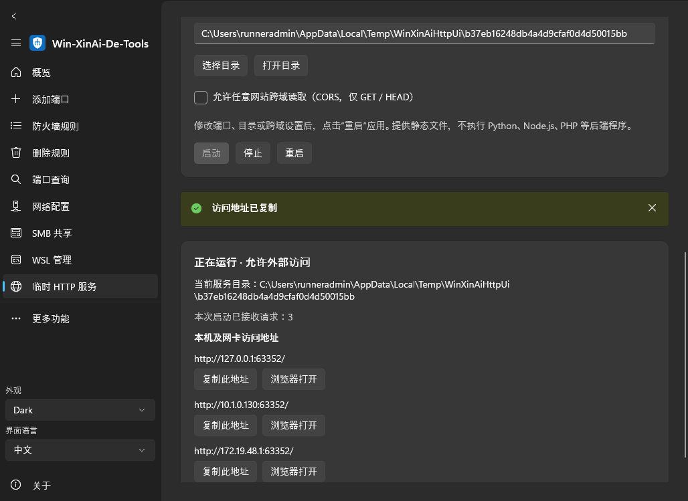

# Temporary HTTP server / 临时 HTTP 服务

Open **Temporary HTTP server / 临时 HTTP 服务** in the sidebar or More features.

1. Choose a directory, or enter its existing path. **Open folder / 打开目录** opens this configured path in Explorer.
2. Keep port **8980**, or enter an integer from 1 to 65535.
3. Click **Start / 启动**. The server listens on all IPv4 interfaces and on all IPv6 interfaces when IPv6 is supported. A temporary inbound TCP Windows Firewall rule allows any remote address on all profiles, scoped to this application and the chosen port.
4. **Open in browser / 浏览器打开** tests the local `http://127.0.0.1:PORT/` address. Each displayed address has its own **Copy this address / 复制此地址** and **Open in browser / 浏览器打开** actions. Copy selects exactly that URL, so local, IPv4, and IPv6 addresses can be shared independently.
5. After changing the port, directory, or optional CORS setting, click **Restart / 重启** to apply them. Invalid settings are rejected before stopping an existing server; a binding/firewall failure leaves it stopped and reports the error. Start does not silently replace an existing server.
6. **Stop / 停止** closes listeners and removes only the rule created by this server instance. A failed firewall cleanup remains visible and can be retried with Stop. Exiting the application also stops the server. Navigation, language/theme changes, and minimizing to the tray keep a running service alive. The service does not start automatically on application launch.

## Existing local HTTP servers / 本机已开启的 HTTP 服务

进入页面后，顶部自动列出本机已响应 HTTP 的地址，显示端口、HTTP 状态码、PID 和可读取的进程名称。每条地址可单独复制或打开；点击 **刷新检测** 重新检测。启动、停止或重启本工具的服务后也会刷新。列表用“本工具启动”标识当前受控实例；其他应用的服务仅显示，不会被停止或修改。

Discovery reads the Windows IPv4/IPv6 TCP listener tables and sends `HEAD /` to their local addresses (wildcard binds use loopback). Any valid HTTP status, including redirects, authentication errors, 404, and 405, confirms HTTP. Multiple addresses can belong to one server. Process details are best effort and represent the listener snapshot, not an ownership guarantee after the scan.

- Only actual local TCP listeners are probed; there is no LAN/internet port scan. HTTP probes may appear in server access logs/request counters.
- Up to 16 probes run concurrently, each with a one-second timeout and a ten-second overall probe deadline. Response headers are capped at 16 KiB; response bodies are not downloaded. Leaving the page cancels detection. Deadline-limited results are labeled incomplete.
- Probes disable proxies, redirects, cookies, and credentials. Detection does not open firewall rules or control other services.
- HTTP detection cannot establish whether a service is “temporary.” HTTPS-only services, virtual hosts requiring a hostname, and slow/unresponsive servers may not appear. The list is a snapshot: refresh if another application starts or stops a server.
- A detected URL confirms a local HTTP response only; it does not prove access from the internet.

## What it serves

This is an embedded ASP.NET Core Kestrel **static file server**, comparable to `python -m http.server`, requiring no separate Python, Node.js, .NET, or ASP.NET installation with a self-contained package.

- `/` serves `index.html` or `index.htm` if present, otherwise an HTML-escaped directory listing (up to 1000 entries; other files remain available by direct URL).
- Subdirectories, JSON, HTML, JavaScript, CSS, and other regular files can be fetched with GET or HEAD. Unknown extensions download as `application/octet-stream`.
- Files are streamed and changes are visible on subsequent requests. Responses disable caching for temporary development use.
- Optional CORS permits cross-origin GET/HEAD from any origin without credentials. It is disabled by default and is separate from network reachability.
- Missing paths return 404; writes/POST/PUT/DELETE return 405. No upload, command execution, application-management API, or dynamic Python/Node.js/PHP backend is provided. For a mock API, place JSON responses under the chosen directory, for example `api/status.json`.
- Requests cannot use parent traversal, Windows alternate streams, or symbolic links/junctions below the root to select files outside the directory. Select a real folder; avoid changing filesystem links while serving. HTTP is unencrypted and files require no login. Share only the directory intended for public access.

## Internet access / 外网访问

本工具按要求放开本机监听和 Windows 防火墙：IPv4 `0.0.0.0:端口`，支持 IPv6 时也监听 `[::]:端口`，允许任意来源访问。**不会修改路由器、运营商网络或云安全组，也不会把局域网 IP 当成公网 IP。**

- 有公网 IP 的电脑：外部访问 `http://公网IP:8980/`（自定义端口时替换 8980）。
- 路由器后面的电脑：配置 TCP 端口转发至本机局域网 IP 和服务端口。
- 云服务器：还需在云安全组或上游防火墙中放行该 TCP 端口。
- 运营商 NAT / CGNAT：通常需要向运营商申请公网 IP，或另行配置隧道。
- 使用公网 IPv6：访问 `http://[公网IPv6地址]:端口/`，并确认路由器 IPv6 入站策略允许访问。

The app displays interface addresses, not a verified public URL. Use a separate external network to confirm public reachability. No public-IP lookup request is sent automatically.

## Validation and cleanup

Automated tests cover real HTTP GET/HEAD, MIME types, directory listings, CORS, unsupported methods, traversal/link rejection, port conflicts, restart, disposal, and firewall failure rollback/retry. Opt-in Windows integration creates an application-scoped rule, verifies all profiles and an interface HTTP request, and verifies removal. The packaged GUI test invokes Start/Restart/Stop, checks requests and survival across navigation/language changes, verifies individual clipboard URLs, automatic/manual discovery of managed and independent fixtures, and removal of stale ports, then cleans up its test directory and firewall rule. Discovery unit tests also cover IPv4/IPv6 listener enumeration and PID mapping, non-HTTP/silent sockets, cancellation, duplicate endpoints, every HTTP status class, and redirect/body suppression.

A forced process kill, power loss, or OS crash can leave a firewall rule named `Win-XinAi-De-Tools Temporary HTTP <unique-id>`. The listener closes with the process. Any residual rule is restricted to this executable and port and can be removed in the existing firewall-rule page. Normal Stop and Exit remove the rule automatically. Public-internet routing, folder-picker interaction, and Explorer/browser opening require Windows/manual environment verification.
